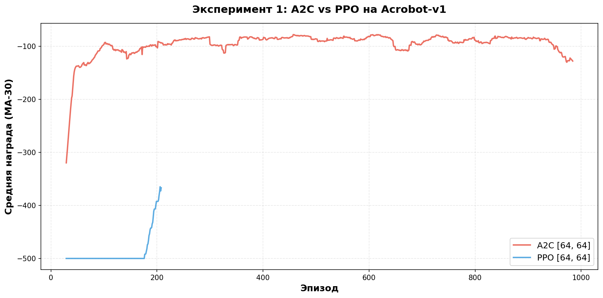
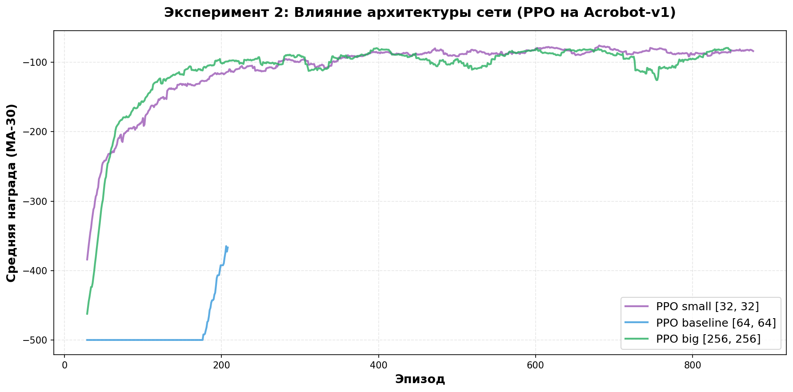

# Решение задачи Acrobot-v1 (Reinforcement Learning)

В данном репозитории представлено решение задачи управления Acrobot-v1 с использованием библиотеки Stable-Baselines3. Проведены контролируемые эксперименты для сравнения алгоритмов и архитектур нейросетей.

## Отчет о работе

### 1. Краткое описание задачи и подхода
Решалась классическая задача управления Acrobot-v1 (Gymnasium). Среда представляет собой двойной маятник, где цель агента — раскачать систему, прикладывая крутящий момент только ко второму суставу, чтобы нижний конец коснулся целевой высоты.

- Среда: Acrobot-v1 (непрерывное состояние: 6 переменных, дискретные действия: 3 варианта).
- Подход: Использовалась библиотека Stable-Baselines3. Для обеспечения воспроизводимости все эксперименты проводились на CPU с фиксированным seed=123.

### 2. Код обучения и параметры
Полный код обучения и графики доступны в ноутбуке Acrobot_RL_Solution.ipynb в этом репозитории.

Основные параметры эксперимента:
- Алгоритмы: PPO (Proximal Policy Optimization) и A2C (Advantage Actor Critic).
- Общие настройки:
  - total_timesteps: 100,000 шагов
  - seed: 123 (фиксирован для random, numpy, torch)
  - device: cpu
  - policy: MlpPolicy (полносвязная нейросеть)

Эксперимент 1 (Сравнение алгоритмов):
- A2C: learning_rate=7e-4, n_steps=5, gamma=0.99, архитектура [64, 64].
- PPO: learning_rate=3e-4, n_steps=2048, batch_size=64, архитектура [64, 64].

Эксперимент 2 (Архитектура сети для PPO):
- Small: net_arch=[32, 32] (малая сеть)
- Baseline: net_arch=[64, 64] (средняя сеть)
- Big: net_arch=[256, 256] (большая сеть)

### 3. Краткий анализ результатов

Гипотезы:
Проверялось две гипотезы:
1. Алгоритм PPO будет обучаться стабильнее и эффективнее, чем A2C на данной задаче.
2. Изменение размера нейросети (уменьшение или увеличение) может ускорить сходимость по сравнению с базовой архитектурой.

Результаты:
- PPO vs A2C: PPO показал подавляющее превосходство. Агент A2C не смог обучиться (средняя награда осталась на минимуме -500), тогда как PPO достиг среднего результата -218.
- Архитектура: Лучший результат показала самая маленькая сеть [32, 32] (награда -86.35, высокая стабильность). Базовая сеть [64, 64] оказалась наименее стабильной в данном запуске.

Идеи для дальнейших шагов:
Для улучшения результата стоит провести автоматический подбор гиперпараметров (learning_rate и gamma) с помощью библиотеки Optuna, так как даже малая сеть показала отличный потенциал. Также можно попробовать off-policy алгоритмы (например, DQN или SAC с дискретизацией), чтобы повысить эффективность использования данных.

## Визуализация результатов

График 1: A2C против PPO

График 2: Влияние архитектуры сети

## Запуск проекта
1. Установите зависимости: pip install -r requirements_acrobot.txt
2. Запустите ноутбук в Jupyter или Colab.
